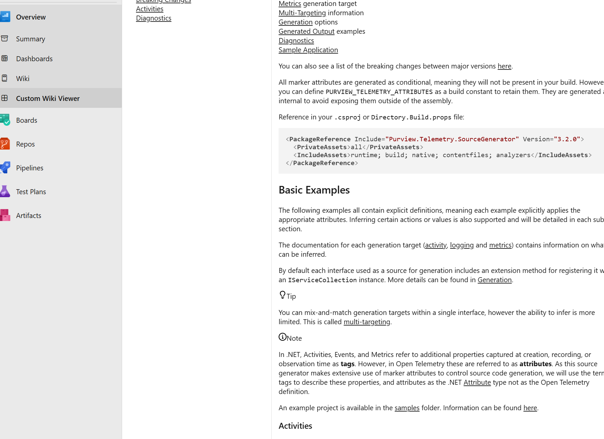
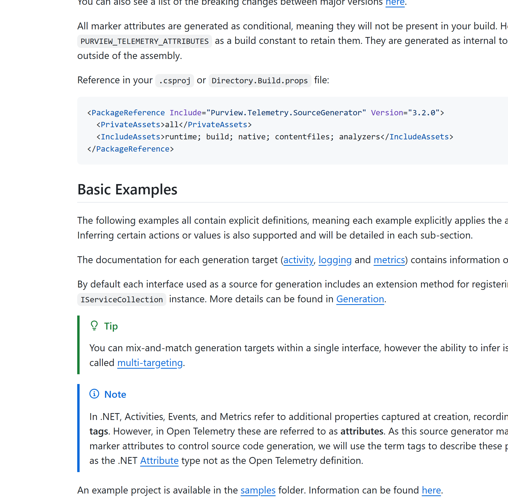

I've been noodling on this for a few days, and despite how baffling and disjointed the Azure DevOps extensions documentation is, I think I've got a good start on a workable solution...

> [!CAUTION]
> Being forced to use React 16 in 2025 while using _any_ packages is painful! 🩻

All of this is because I wanted some basics..

Like being able use [Mermaid](https://mermaid-js.github.io/mermaid/#/) in Azure DevOps wikis that actually renders correctly! 😁 (don't ask)

Or the awesome [alerts](https://docs.github.com/en/get-started/writing-on-github/getting-started-with-writing-and-formatting-on-github/basic-writing-and-formatting-syntax#alerts) feature!

... like this:

> [!NOTE]
> This is a note 📔.

> [!TIP]
> This is a tip ℹ️.

> [!IMPORTANT]
> This is important 🔔.

> [!WARNING]
> This is a warning ⚠️.

> [!CAUTION]
> This is a cautionary tale about trying to use React 16 in 2025 with modern packages.
>
> ☠️ 📎

---

## 2025-05-01 ... Packing up shop... for now

I've been working on this for a few days now, and while I have a working prototype, I think it's time to take a break - while good progress was made. There's a few things I've discovered that need more time/ energy/ effort that I have at the moment:

### Functionality

It would need to be able to handle the following:

- [ ] Support for the existing Azure DevOps wiki features (like the alerts above)
  - [ ] Editing, or links back to the editor
  - [ ] Commenting...like the existing one.
  - [ ] Viewer numbers/ favourites/ etc
  - [ ] The tree view on the left is just some nested UL right now... no interactivity.

#### Attachment (re: images) rendering

Rendering attachments (images, etc) isn't ideal. The links come down as relative links...which 403.

Looking at the working Wiki, the url used includes a bunch of additional (undocumented) parameters that are not included in the Azure DevOps wiki API... that I can see at least.

#### Mermaid rendering

The mermaid rendering is slow. Really slow... and that's on my machine which is a beast. Like the default Wiki, it would need to be lazy loaded - I'm not a React expert, so this will have to wait!

#### Parsing/ Styling/ Rendering

It seems like I'm fighting the parsing/ styling at every turn. Nested UL/OLs are not correctly parsed (they surface as div?!) and so they look shocking.

The mermaid container is tiny... I didn't spend much time of this, but still more effort required.

The syntax highlighting ... just doesn't look right...

### Where I'm leaving it (for now)...

## 2025-04-29 ... current situation

I've imported some of the [Purview Telemetry Source Generator](https://github.com/kjldev/purview-telemetry-sourcegenerator) wiki to help with testing...

Here's the current state of the extension:

... and here is the original/ GitHub version of the same page:

---

As you can see... it's not quite there yet, but solid progress so far!
