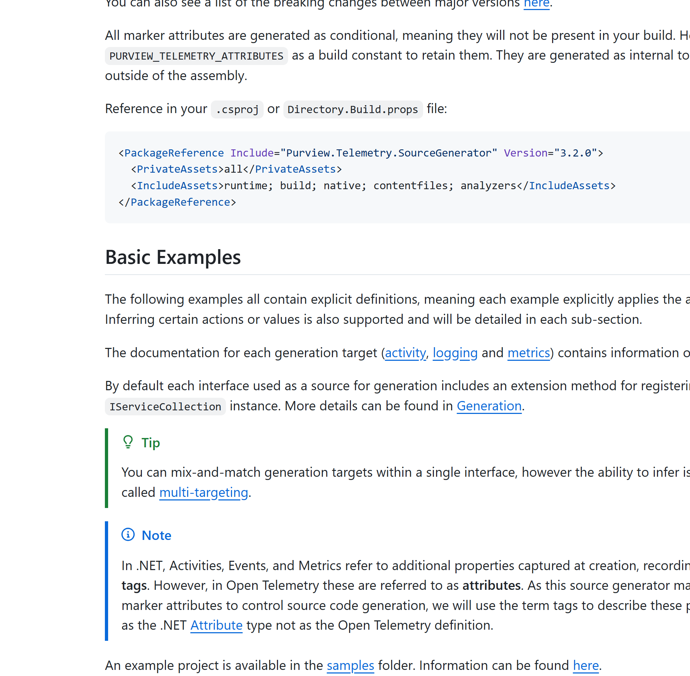

## The Ask

What I wanted 💖 for our development and engineering teams is:

- A wiki that embraces a **modern approach to documentation**, and for
  technical writing that is markdown-based, has a WYSIWYG and code editor
  (VS-Code?) and supports the latest extensions of Markdown.
- **Mermaid rendering** that works (!!).
- **Callouts/ admonitions** that are easy to use, and look good.
  - This should include collapsible sections, titles, and customisable icons!
- The Azure DevOps Wiki is based on a git repository (you can clone it
  to your machine), so using some repository rules we should be
  able to put a **draft and approval workflow** in place using a combination
  of pull requests and branch policies...but it's too abstracted away at the moment.
- Incredible search capabilities, and the ability to
  **interact with Microsoft Copilot** for generative based chat.

This is almost like a mini-Confluence, but with a focus on technical writing
against an engineering product that teams already use.

As much as GitHub is awesome (and I use it for my personal projects), Azure DevOps
is the platform of choice for _a lot_ of Enterprises the world over - including mine.

---

### Some bits I've been playing with

What I've done so far, aside from the extension journey below, is:

- Create a .NET service that pulls from the Wiki (via the
  [REST API](https://learn.microsoft.com/en-us/rest/api/azure/devops/wiki/wikis?view=azure-devops-rest-7.1)),
  and pushes the
  content into Microsoft Copilot.
- This same service also runs the wiki content through a
  Markdown parser that does it's best to convert (and fix some bad content) into
  a React format that can be rendered in an another site.
  - This supports some of the rendering I was after, and lazily loaded
    mermaid diagrams.
- Build an [Astro](https://astro.build/) site that uses its
  Markdown parser to render the content.
  - This was actually pretty successful - especially as you can integrate
    React/ Preact into it. It also meant it could be hosted outside of
    Azure DevOps, and removed the need to assign Azure
    DevOps Stakeholder licenses to all users (which was nothing more than
    a minor management overhead TBF))..._democratising content FTW!_

---

## The Azure DevOps Extension Journey

I've been noodling on an Azure DevOps Extensions for a Wiki-UI for the past few days,
and despite how baffling and disjointed the Azure DevOps extensions documentation
can seem, I think I've got a good start on a workable solution...

> [!WARNING]
>
> If you go down this route yourself, be warned that Azure DevOps extensions
> are built using React 16 - this can make importing NPM packages
> a challenging experience! 🩻

All of this is because I wanted some basics..

Like being able use [Mermaid](https://mermaid-js.github.io/mermaid/#/) in
Azure DevOps wikis that actually renders correctly! 😁 (don't ask)

Or the awesome [alerts](https://docs.github.com/en/get-started/writing-on-github/getting-started-with-writing-and-formatting-on-github/basic-writing-and-formatting-syntax#alerts)
feature!

... like this:

> [!NOTE]
>
> This is a note 📔.

> [!TIP]
>
> This is a tip ℹ️.

> [!IMPORTANT]
>
> This is important 🔔.

> [!WARNING]
>
> This is a warning ⚠️.

> [!CAUTION]
>
> This is a cautionary tale about trying to use React 16 in 2025 with modern packages.
>
> ☠️ 📎

---

## 2025-04-29 ... current situation

I've imported some of my [.NET Telemetry Source Generator](https://github.com/kjldev/purview-telemetry-sourcegenerator)
wiki to help with testing...

Here's the current state of the extension:

... and here is the original [GitHub Wiki](https://github.com/kjldev/purview-telemetry-sourcegenerator/wiki)
version of the same page:

---

As you can see... it's not quite there yet, but solid progress so far!

---

## 2025-05-01 ... Packing up shop... for now

I've been working on this for a few days now, and while I have a working
prototype, I think it's time to take a break - while good progress was made,
I realised that there is much more to do than just fix the rendering.

### Missing Functionality

It would need to be able to handle the following:

- [ ] Support for the existing Azure DevOps wiki features
  - [ ] Editing, or links back to the editor
  - [ ] Commenting...like the existing one.
  - [ ] Viewer numbers/ favourites/ etc
  - [ ] The tree view on the left is just some nested UL right now... no interactivity.
  - [ ] Extensive amount of ADO-based extensions for:
    - Board query rendering
    - Work-item rendering
    - etc... there are a lot of them!

#### Attachment (re: images) rendering

Rendering attachments (images, etc) isn't ideal. The links come down as relative
links...which 403.

Looking at the working Wiki, the url used includes a bunch of additional
parameters that are not included in the Azure DevOps
wiki API... that I can see at least.

#### Mermaid rendering

The mermaid rendering is slow. Really slow... and that's
on my machine which is a beast. Like the default Wiki, it would
need to be lazy loaded - I'm not a React expert, so I'll have to come back to this!

#### Callouts/ Admonitions

I'd love to see proper support for the callouts/ admonitions (like the GFM-alerts).

Some nice examples are:

- [MyST](https://mystmd.org/guide/admonitions)
- [Obsidian](https://help.obsidian.md/callouts)

Both support a wide range of styling options, including titles, icons, and collapsible
sections.

#### Parsing/ Styling/ Rendering

It seems like I'm fighting the parsing/ styling at every turn.
Nested UL/OLs are not correctly parsed (they surface as div?!) and so they look shocking.

The mermaid container is tiny... I didn't spend much time of this,
but still more effort required.

### Where I'm leaving it (for now)

<iframe src="https://player.vimeo.com/video/1083436111?h=198fb52949&amp;badge=0&amp;autopause=0&amp;player_id=0&amp;app_id=58479" frameborder="0" allow="autoplay; fullscreen; picture-in-picture; clipboard-write; encrypted-media" style="position:absolute;top:0;left:0;width:100%;height:100%;" title="Azure DevOps Wiki Extension"></iframe>

## 2025-05-04 ... OK, I'm really leaving it for now!

I managed to add a few really nice features like the lazy loading of
the mermaid diagrams, and some more processing options for the admonitions.

But also integrated better syntax highlighting through the use
of the excellent [Expressive Code](https://expressive-code.com/) - the
rendering is perfect.

Unrelated to the rendering of the wiki was the most useful feature to date...
importing it into Microsoft Copilot for some AI magic so our developers,
and engineers can ask questions and get real, update to date, relevant answers.

> [!IMPORTANT]
>
> This will be a game changer for us, I'll figure out a means of integrating
> this somehow in the future.
